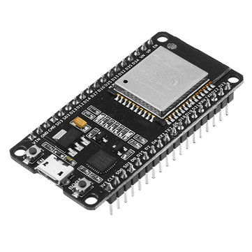
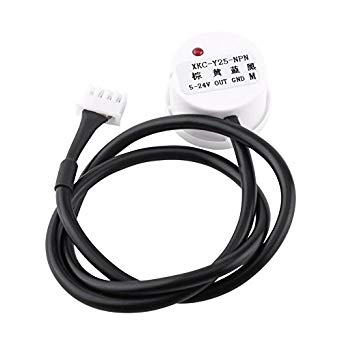
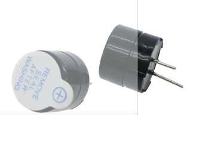
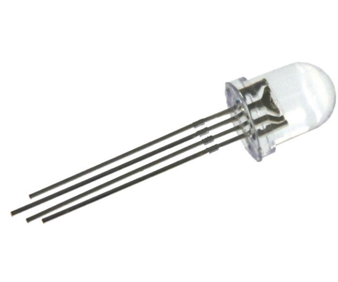
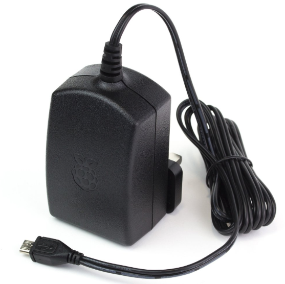
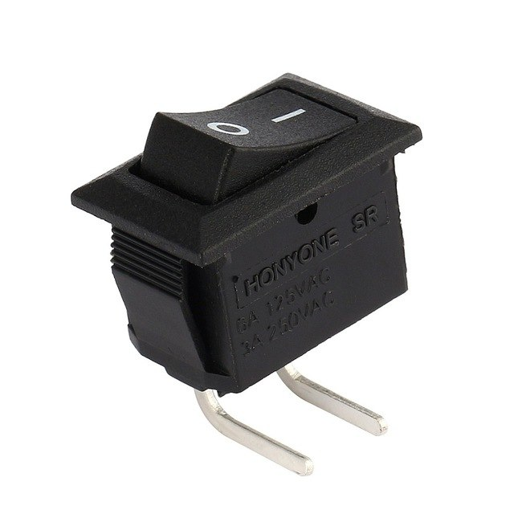

# nowater
Automatic system to alert (with a buzzer and a LED) when the water level in a tank drops below a given threshold.

## Hardware

| **Qt**  | **€/un*** | **Ʃ €** | **Photo**                                   | **Description**                                                                                                                                                                                                        | Notes                                                                               |
|---------|----------|----------|---------------------------------------------|------------------------------------------------------------------------------------------------------------------------------------------------------------------------------------------------------------------------|-------------------------------------------------------------------------------------|
| 1       | 7       | 7       |            |[ESP-32 WROOM dev board](https://www.aliexpress.com/item/ESP32-ESP-32-ESP32S-ESP-32S-CP2102-Wireless-WiFi-Bluetooth-Development-Board-Micro-USB-Dual-Core/32867696371.html)                                       | Microcontroler                                                                            |
| 1       | 5     | 5     |        |[XKC-Y25-NPN](https://www.aliexpress.com/item/XKC-Y25-NPN-Water-Level-Sensor-Non-Contact-Liquid-Level-Sensor-Detection-Tools-for-Airtight-Container/32864811235.html)                                                                                                                                     | Non-Contact Liquid Level Sensor                                                      |
| 1       | 0.1      | 0.1      |         |► [Active Buzzer Alarm 5 V](https://www.aliexpress.com/item/10pcs-5v-Active-Buzzer-Magnetic-Long-Continous-Beep-Tone-Alarm-Ringer-12mm-MINI-Active-Piezo-Buzzers/32914327679.html)                                     | Audible sound to alert for the end of a test                                         |
| 1       | 0.1      | 0.1      |        |► [5mm Through-Hole RGB LED](https://www.aliexpress.com/item/100pcs-lot-Transparent-Round-5mm-RGB-LED-Common-Anode-LED-Light-Emitting-Diode-Lamp/32278301731.html)                                                     | Indicative multicolor LED                                                            |
| 1       | 8        | 8        |   |[5V microUBS Power Supply](https://www.raspberrypi.org/products/raspberry-pi-universal-power-supply)                                                                                                                   | Power up the ESP-32 and the sensors                                           |
| 1       | 1        | 1        |   |[SPST 2P 2 Position AC 125V/6A 250V/3A Right Angle Boat Rocker Switch ](https://www.aliexpress.com/item/5Pcs-AC-125V-6A-250V-3A-SPST-2P-2-Position-Right-Angle-Boat-Rocker-Switch-UL/32828008287.html)                                                                                                                   | Power up the ESP-32 and the sensors                                           |

## Software  

The code was developed in micropython for controllers and flashed into the ESP32.